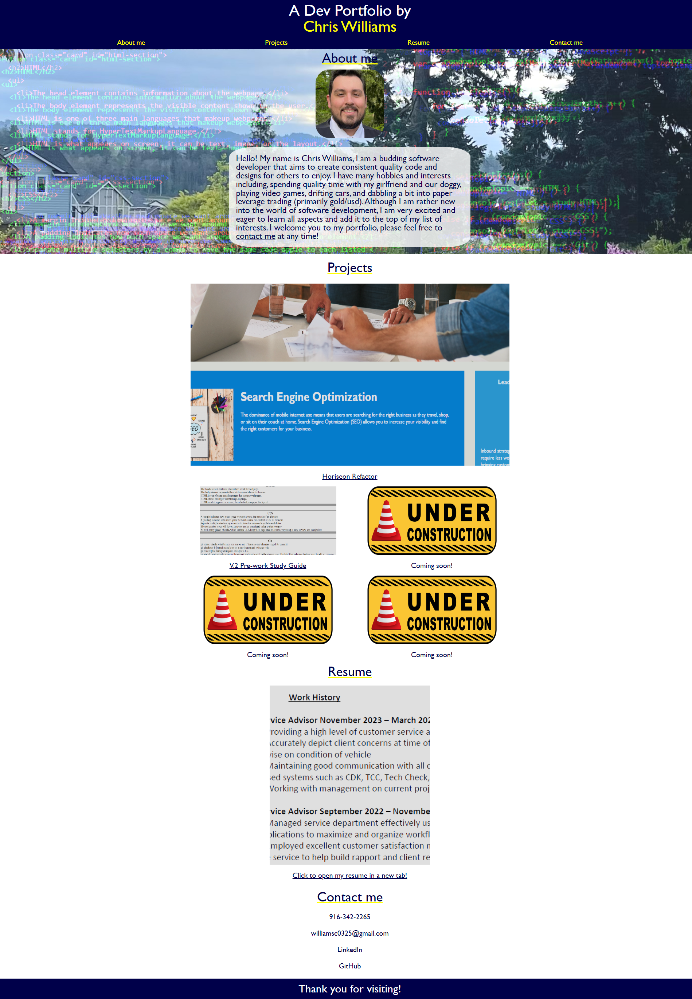

# Welcome to my Developer Portfolio! 

 <strong>Please feel free to visit my developer portfolio listed here:</strong>
 

[Click here for my portfolio](https://xchrisxwilliamsx.github.io/dev-portfolio)

 I welcome you to view a bit about myself, my current projects, resume, and a way to reach out to me. 

 Each external hyperlink will open a new tab to a repo which will allow you to open a deployed website.

 If you would like to connect with my please reach out to me.  

 <strong> Webpage should render as such: </strong>

## Have some suggestions on portfolio, click link below and create an issue.
 

[GitHub Repo](https://github.com/xChrisxWilliamsx/dev-portfolio)

### Sources

* reset.css supplied by [meyerweb](http://meyerweb.com/eric/tools/css/reset/)
* stock photo of under construction picture from [Pixabay](https://pixabay.com/illustrations/sign-cone-symbol-traffic-warning-2408065/)